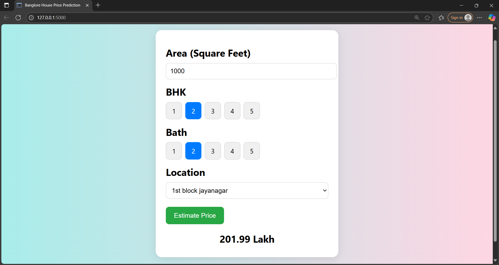

# Bangalore House Price Prediction

A machine learning web application that predicts house prices in Bangalore, India, based on features like location, total square feet, number of bedrooms (BHK), and bathrooms. The project combines data preprocessing, regression modeling, and a simple **Flask web interface**.

---

## Problem Statement

The real estate market in Bangalore is complex and highly location-dependent. Manually estimating a fair property price based on features like location, size, and amenities can be challenging.

### Goal:
> To build a **machine learning model** that can predict the **approximate price of a house in Bangalore** given user input, and integrate it with a **Flask-based web interface** for ease of access.

---

## Solution

We trained a regression model using housing data of Bangalore. The model learns to predict price per square foot based on the following features:

- Location
- Total Square Feet
- Number of Bedrooms (BHK)
- Number of Bathrooms

A simple web interface allows users to enter property details and receive a real-time predicted price.

---

## ML Details

- **Model Used:** Linear Regression 
- **Data Source:** Bengaluru_House_Data.csv
- **Target Variable:** Price (in Lakhs)
- **Evaluation Metrics:** RMSE, R² Score


---

## Tech Stack

- **Frontend:** HTML, CSS, JS (via Flask templates)
- **Backend:** Flask (Python)
- **ML:** scikit-learn, pandas, numpy
- **Model Serialization:** pickle
- **Data:** CSV-based housing dataset

---

## How to Run the Project

### 1. Clone the repository
```bash
git clone https://github.com/your-username/bangalore-house-price-prediction.git
cd bangalore-house-price-prediction
```

### 2. Set up a virtual environment
```bash
python -m venv venv
venv\Scripts\activate    # On Windows
source venv/bin/activate # On Linux/Mac
```

### 3. Install dependencies
```bash
pip install -r requirements.txt
```

### 4. Run the Flask application
```bash
python server.py
```

### 5. Open your browser and visit:
```bash
http://127.0.0.1:5000
```

### This is what our UI looks like :


--- 
